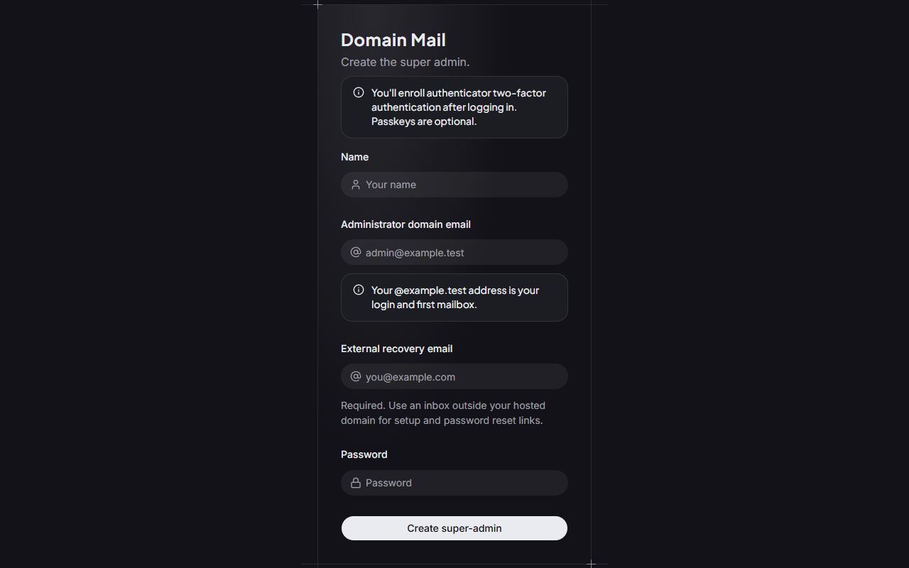
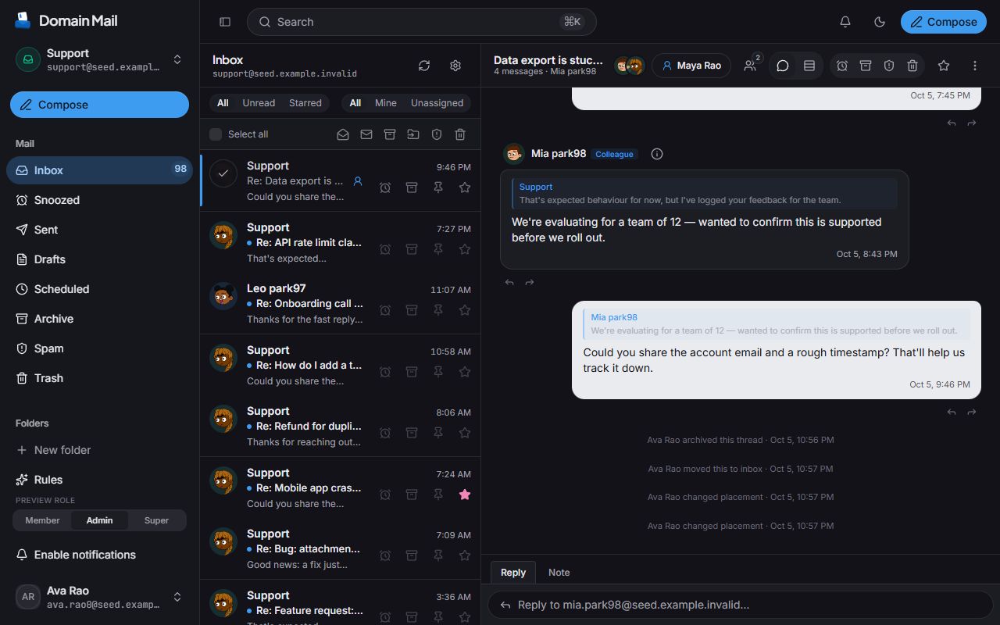
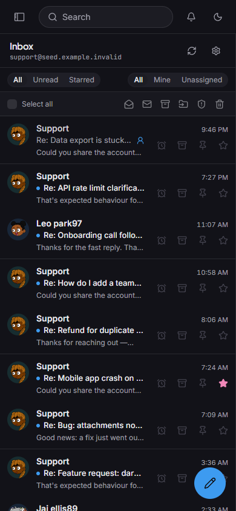
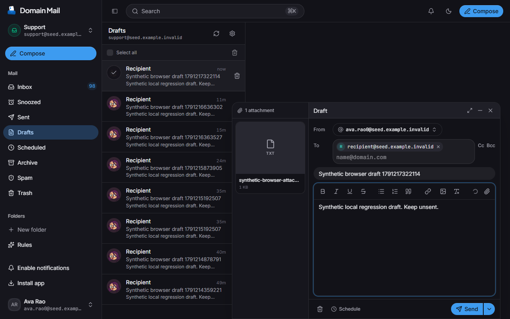

# Installation screenshots

These are real captures of the local application with synthetic test data.
They show the reusable wizard and mail client; no production mailbox data or
credentials appear. The desktop role-preview control is development-only.

## Protected administrator setup

The configured domain supplies the login and first mailbox. An external recovery
inbox and administrator TOTP enrollment are required. Opening setup after the
first successful account redirects to login. Passkeys are optional.

## Desktop inbox and conversation

The shared synthetic mailbox displays its conversation list and decrypted
timeline after marking a message read. Reading a conversation preserves the
remaining inbox rows.

## Mobile inbox

The same mailbox at a 390-pixel viewport displays the inbox, search and a floating
compose action. This is browser viewport evidence, not a physical-device test.

## Saved draft with attachment

The synthetic recipient, subject, body and text attachment survive closing and
reopening the draft. The browser regression checks authenticated attachment
download and byte equality. The draft remains unsent.

These screenshots do not prove Cloudflare account provisioning or external
mail delivery.
